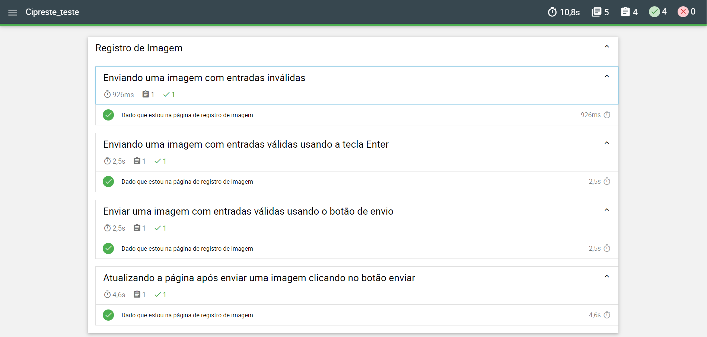

# Cypress
Aprendendo a usar a ferramenta de Cypress

## 1-Pré-requisitos 

- java 17

- Git 

- Node.js 

- Cypress

## 2-Clonar o Repositório

1. Clone o repositório:
    ```bash
    git clone https://github.com/Lucca08/Cypress.git
    cd Cypress
    ```

## 3-Cenários de teste

[CenariosDeTeste.feature](CenariosDeTeste.feature)

## 4-Instalar Dependências
 
1. Instale as dependências do Node.js:
    ```bash
    npm install
    ```

## 5-Rodar os Testes
1. Para abrir cypress:
    ```bash
    npx cypress open
    ```
2. Para rodar headless
     ```bash
    npx cypress run
    ```
3. Ou usar o ntl:
    ```bash
    npx ntl
    ```

## 6-Gerando Relatórios de Teste

1. Instale o `mochawesome`:
    ```bash
    npm install --save-dev mochawesome
    ```

## 7-Acessar relatório

1. busque o cypress\reports\mochawesome.html e abra com o live server 

## 8-Relatório


